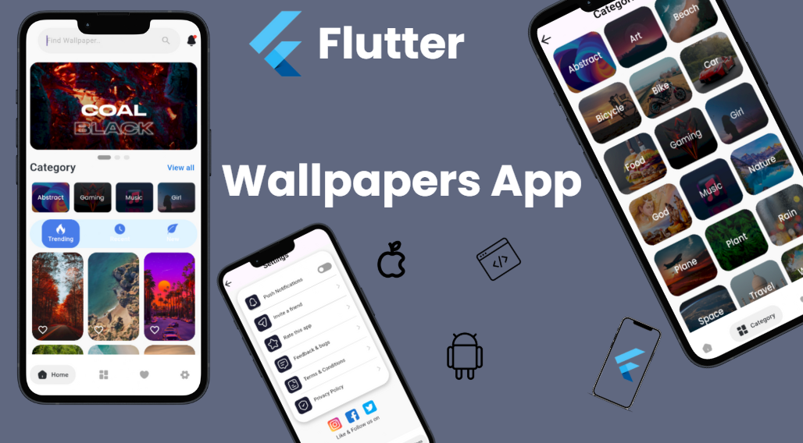

# 🖼️ Wallpaper Hub – Flutter App

**Wallpaper Hub** is a beautifully designed Flutter app that brings you a massive collection of high-quality wallpapers—categorized, curated, and just a tap away. Whether you're into abstract art, nature, gaming, or minimalism, Wallpaper Hub helps you personalize your phone effortlessly.

---

## ✨ Key Features

- 🏠 **Home Screen**  
  Discover featured wallpapers and the latest additions, all in one swipeable view.

- 🗂️ **Categories**  
  Browse by style and mood—choose from Abstract, Nature, Gaming, Art, and more.

- ❤️ **Favorites**  
  Love a wallpaper? Save it to your favorites and access it anytime.

- ⚙️ **Profile & Settings**  
  Control push notifications, rate the app, send feedback, and review our privacy policy.

- ⬇️ **One-Tap Download**  
  Download and apply wallpapers instantly with a single tap.

---

## 🚀 Built With

- Flutter & Dart  
- Clean Architecture  
- Responsive UI for Android & iOS

---

## 📂 Project Status

- ✅ Initial Release Complete  
- 🚧 Upcoming: Dark Mode, Wallpaper Sharing, Offline Favorites

---

## 🙋‍♂️ Author

**Hazem Ahmed**  
🔗 [LinkedIn](https://www.linkedin.com/in/hazem-ahmed-39273b309/)  
📧 hazemahmedd56@gmail.com  

> “Personalize your screen, one wallpaper at a time.”
